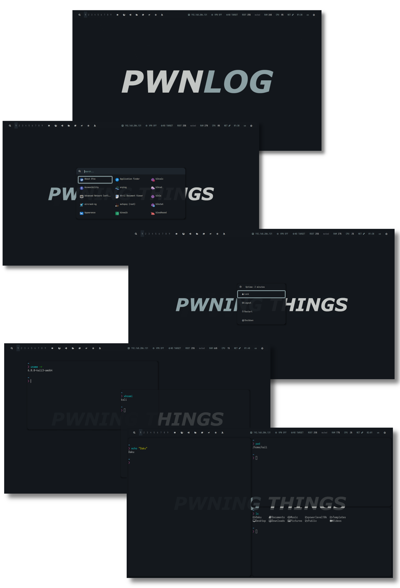
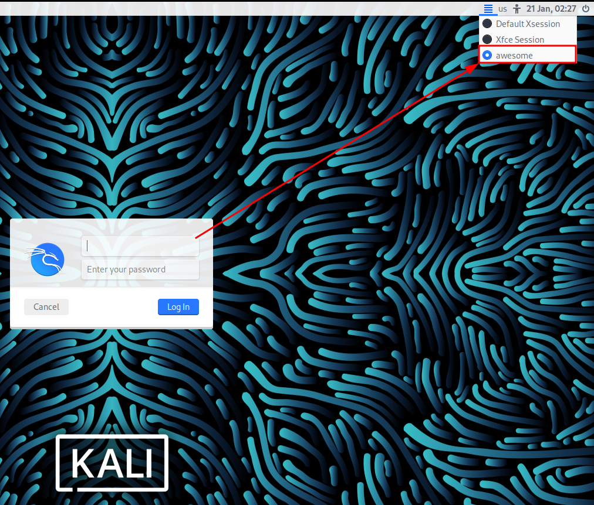
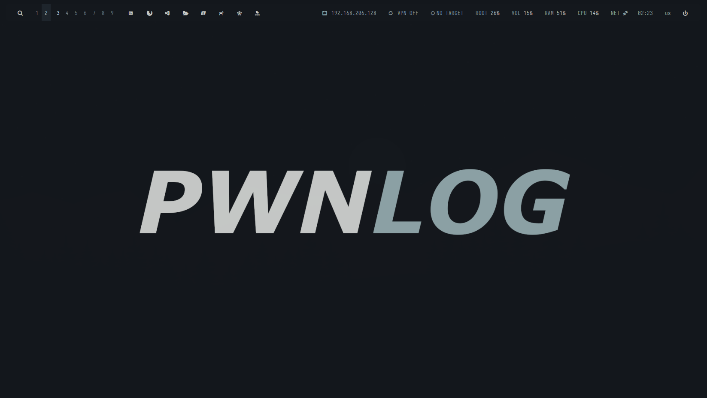

<!-- DAKU BANNER -->
<div align="center">
   <a href="#--------">
      
   </a>
</div>

<!-- TOC -->
<p align="center">
<a href="#snowflake-information"></a>
<a href="#hammer_and_wrench-setup"></a>
</p>

<!-- RICE PREVIEW -->
<div align="center">
   <a href="#--------">
      
   </a>
</div>

<br>

# :snowflake: Information

Daku is a pen testing Linux configuration with dark colors.

> **Note**: This project is currently on development.

<div>


<table align=left><tr><td>
<b>- Operating System: </b><br />
<b>- Display Manager: </b><br />
<b>- Window Manager: </b><br />
<b>- Application Launcher: </b><br />
<b>- Compositor: </b><br />
<b>- Terminal: </b><br />
<b>- Shell: </b><br />
<b>- Editor: </b><br />
<b>- Audio: </b><br />
<b>- Music Player: </b><br />
<b>- Wallpaper: </b><br />
</table>

<table><tr><td>
<a href="https://www.kali.org/">Kali Linux</a><br />
<a href="https://github.com/canonical/lightdm">LightDM</a><br />
<a href="https://awesomewm.org">AwesomeWM</a><br />
<a href="https://github.com/davatorium/rofi">Rofi</a><br />
<a href="https://github.com/yshui/picom">Picom</a><br />
<a href="https://github.com/kovidgoyal/kitty">Kitty</a><br />
<a href="https://www.zsh.org">Zsh</a><br />
<a href="https://code.visualstudio.com/">VSCode</a><br />
<a href="https://www.freedesktop.org/wiki/Software/PulseAudio/Download/">Pulseaudio</a><br />
<a href="https://github.com/ncmpcpp/ncmpcpp">Ncmpcpp</a><br />
<a href="https://github.com/derf/feh">Feh</a><br />
</table>
</div>

# :hammer_and_wrench: Setup

Clone or download the project and navigate into it:

```
cd ~; git clone --depth 1 --recurse-submodules https://github.com/pwnlog/Daku && cd Daku && git submodule update --remote --merge && chmod +x install.sh
```

> **Warning**: If you're copying these files from a Windows system do make sure that is formatted for Unix:

```
find . -type f -print0 | xargs -0 dos2unix
```

Install Daku using the automated installation script:

```
./install.sh
```

> **Warning**: Run this script as a `user` that belongs in the `sudo` group. Do **NOT** run it as the `root` user.

> **Note**: This script has only been tested in `Kali Linux 2022.4` and `ParrotOS 5.2 Security Edition`. If you're using `Parrot` you may need to interact during the installation, for more information, read the [troubleshooting](./TROUBLESHOOTING.md) guide.

Reboot the system:

```
reboot || systemctl reboot
```

Select `awesome` as your window manager and log in:



> **Note**: In other display managers the selection button may be located elsewhere. As an example, see this [image](https://static1.makeuseofimages.com/wordpress/wp-content/uploads/2020/06/muo-linux-display-managers-pantheon-greeter-670x457.png?q=50&fit=crop&w=1500&dpr=1.5).

Congratulations, now you have Daku installed in your system:



> **Note**: You can reload `awesome` with `Super+Alt+R` also known as `Windows+Alt+R`.

# :hearts: Development

While this configuration is pretty awesome, it's still far from over.

Thanks for viewing this project,<br>
~ pwnlog =)